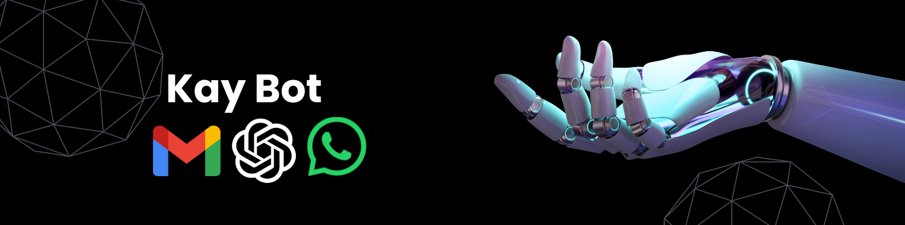

# I am Retiring 😂

My AI clone does it all!




Welcome to Kay Bot, your trusty buddy in the digital world! Ever wish you had an assistant who could handle your WhatsApp messages and emails while you focus on coding the next big thing? Well, look no further! Kay Bot is here to make your life ridiculously convenient and, dare I say, a tad more hilarious!

It's like having a personal assistant who never complains (Or asks for a raise)! 😂

This project started with a simple idea: why not automate everything that makes my life easier? From summarizing news articles to crafting witty replies, Kay Bot does it all, thanks to the magic of OpenAI's GPT-3. And let's not forget the integration with WhatsApp and Gmail APIs.

### Oh, and speaking of hilarious moments, let me share one with you! You know those "kya khaya" messages from Mom that I usually leave on read? Well, Kay Bot thought it would be funny to reply with "not interested" because it assumed I leave those messages on read. I don't type it because, with the long menu options at the IIT mess (flex), it's easier to just call and tell her. Needless to say, Mom was furious and still refuses to believe that it was a bot! But hey, at least it's a good story to tell! 🫠

So, if you're like me – a coding enthusiast who's all about making life more convenient (and maybe a little more amusing) – then Kay Bot is your new best friend. Clone the repo, change the settings to your liking, and let Kay Bot work its magic while you focus on what you do best: coding up a storm!

I am not adding the CSV files here as this is a public platform.

## Features

- Summarize news articles using OpenAI's GPT-3.
- Generate replies to WhatsApp messages and emails using OpenAI's GPT-3.
- Integration with WhatsApp and Gmail APIs for sending and receiving messages/emails.

## Prerequisites

- Python 3.x
- OpenAI API key
- Credentials for WhatsApp API (e.g., Twilio) and Gmail API

## Installation

1. Clone the repository:

   ```bash
   git clone https://github.com/your_username/kay-bot.git
   cd kay-bot

2. Install dependencies:

   ```bash
   pip install -r requirements.txt
   
This will install all the required dependencies for running the project. Make sure you have Python 3.x installed on your system before proceeding with the installation.

